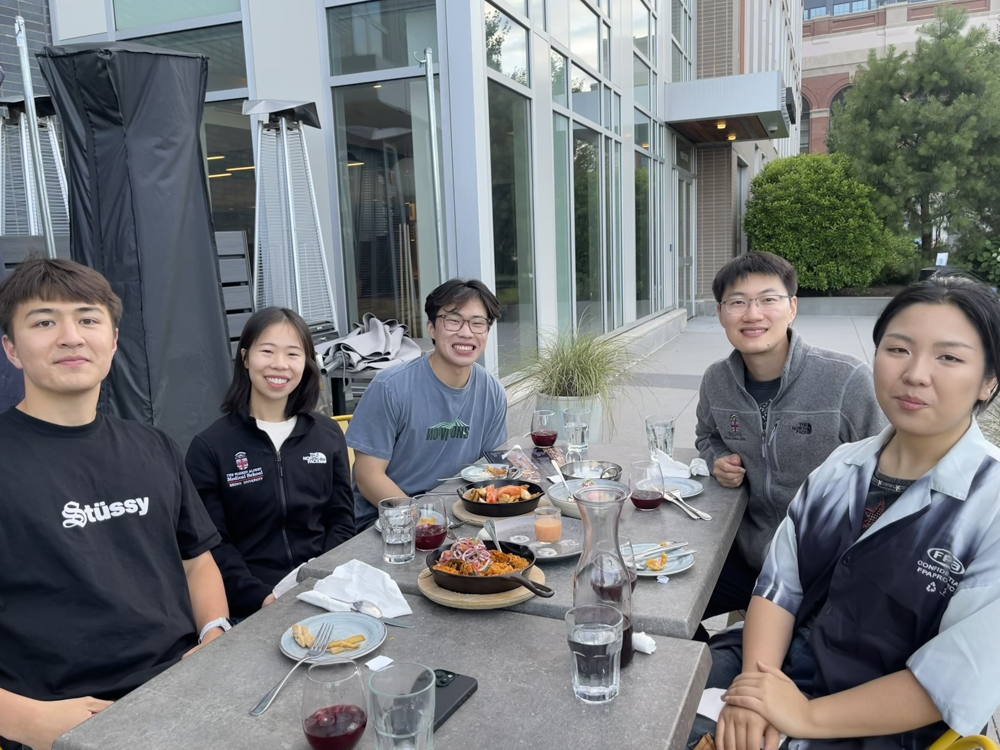

::: {.home-hero}
::: {.home-hero-copy}
::: {.eyebrow}
Stroke research · NeuroAI · Clinical translation
:::

# Better stroke decisions, from data to bedside.

We combine clinical data, neuroimaging, and computational methods to improve stroke prevention, treatment, and recovery.

::: {.hero-actions}
[Explore our research](research.qmd){.btn .btn-primary}
:::
:::

:::: {.home-hero-visual}
{fig-alt="Members of the Shu Lab gathering together"}
::::
:::

::: {.section-shell .intro-band}
::: {.section-heading}
::: {.eyebrow}
What we study
:::

## Three connected research areas

Across each area, we focus on results that can inform clinical care.
:::

::: {.focus-grid}
::: {.focus-card}
::: {.card-number}
01
:::
### Risk & outcomes
We use large clinical datasets and multicenter collaborations to clarify risk, treatment, recurrence, and long-term outcomes across cerebrovascular care.
:::

::: {.focus-card}
::: {.card-number}
02
:::
### Clinical AI
We develop practical methods for turning imaging and unstructured health records into reliable, research-ready evidence.
:::

::: {.focus-card}
::: {.card-number}
03
:::
### Neurorecovery
We pair wearable sensing with machine learning to measure how stroke survivors use the affected arm in everyday activity.
:::
:::

[Learn about our completed work →](research.qmd){.quiet-link}
:::

::: {.tools-preview-band}
::: {.tools-preview-heading}
::: {.eyebrow}
Use the research
:::
## Clinical tools

Public decision-support tools derived from completed, peer-reviewed studies.

[View all tools](tools.qmd){.quiet-link}
:::

::: {.tools-preview-grid}
::: {.tool-preview-card}
::: {.tool-badge}
30-day procedural risk
:::
### Peri-procedural Stroke Risk Calculator
Estimate individualized ischemic-stroke risk using the externally validated Brown model.

[Open calculator ↗](https://liqi-shu.github.io/peri-procedural-stroke-calc/){.btn .btn-primary}
:::

::: {.tool-preview-card}
::: {.tool-badge}
1- and 3-year risk
:::
### DIAS³ Epilepsy Risk Calculator
Estimate epilepsy risk after cerebral venous thrombosis using the internationally validated DIAS³ score.

[Open calculator ↗](https://cerebralvenousthrombosis.com/professionals/dias-3/){.btn .btn-primary}
:::
:::
:::

::: {.section-shell .publication-preview}
::: {.section-heading .heading-row}
::: {}
::: {.eyebrow}
Selected work
:::
## Recent publications
:::

[View all publications](publications.qmd){.quiet-link}
:::

::: {.publication-list}
::: {.publication-row}
::: {.pub-year}
2026
:::
::: {.pub-copy}
### EHR-derived model for 30-day peri-procedural ischemic stroke
*Journal of the American Heart Association* · [Read the paper](https://doi.org/10.1161/JAHA.125.049372)
:::
:::

::: {.publication-row}
::: {.pub-year}
2026
:::
::: {.pub-copy}
### Large language models for scalable stroke chart abstraction
*American Journal of Neuroradiology* · [Read the paper](https://pubmed.ncbi.nlm.nih.gov/41720514/)
:::
:::

::: {.publication-row}
::: {.pub-year}
2024
:::
::: {.pub-copy}
### DIAS³ score for epilepsy after cerebral venous thrombosis
*JAMA Neurology* · [Read the paper](https://pubmed.ncbi.nlm.nih.gov/39432281/)
:::
:::
:::
:::

::: {.join-ribbon}
::: {.join-copy}
::: {.eyebrow}
Work with us
:::
## Build better evidence for stroke care.
We welcome motivated trainees and collaborators.
:::

[Explore opportunities](join.qmd){.btn .btn-primary}
:::
