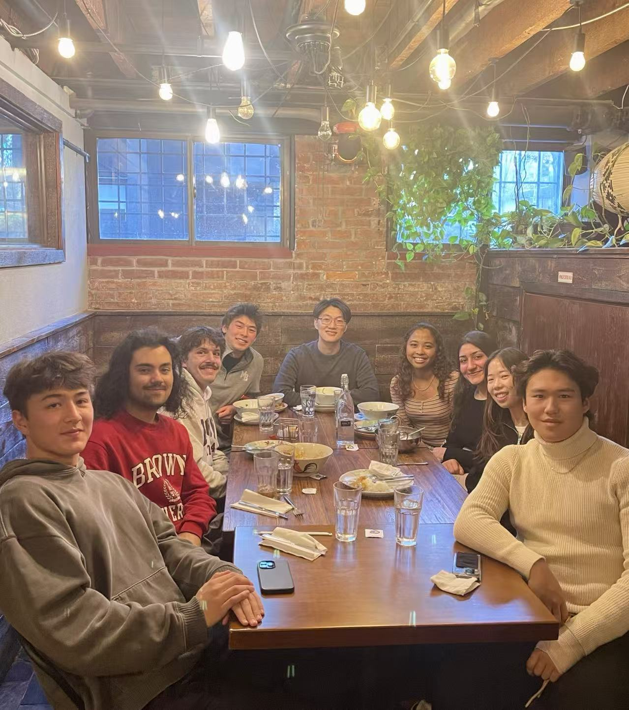
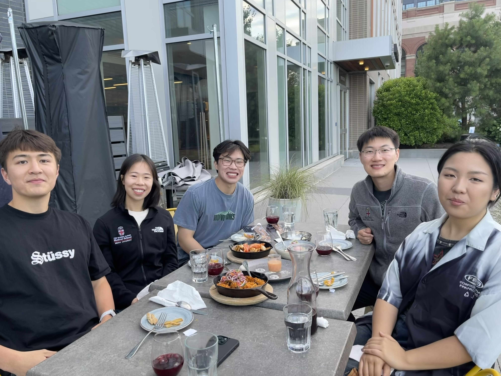

## Lab moments

::: {.columns}
::: {.column width="50%"}
{fig-alt="Lab gathering" style="width:100%; height:280px; object-fit:cover;"}
:::

::: {.column width="50%"}
{fig-alt="Lab gathering" style="width:100%; height:280px; object-fit:cover;"}
:::
:::

## Principal Investigator

::: {.columns}
::: {.column width="25%"}
{fig-alt="Liqi Shu"}
:::
::: {.column width="75%"}
**Liqi Shu, MD**  
Interventional Vascular Neurology (Stroke Institute Fellow) • UPMC Department of Neurology (Pittsburgh, PA)  
Instructor of Neurology (UPMC) • Adjunct Faculty of Neurology (Brown University)
:::
:::

## Key collaborators
::: {.column width="33%"}
::: {.person-card}
{fig-alt="Placeholder" style="width:100%; height:160px; object-fit:cover;"}
**Rebecca Hubbard, PhD**  
Brown University • Carl Kawaja and Wendy Holcombe Professor of Public Health; Professor of Biostatistics & Data Science  
Develops statistical methods for real-world EHR/claims data to improve validity under measurement error, missingness, and complex observation processes.
:::
:::

::: {.column width="33%"}
::: {.person-card}
{fig-alt="Placeholder" style="width:100%; height:160px; object-fit:cover;"}
**Jonghwan Lee, PhD**  
Brown University • Associate Professor of Engineering; Associate Professor of Brain Science  
Leads work at the intersection of biomedical optics/photonics, neural engineering, and AI for next-generation imaging and neurotechnology.
:::
:::

::: {.columns}
::: {.column width="33%"}
::: {.person-card}
{fig-alt="Placeholder" style="width:100%; height:160px; object-fit:cover;"}
**Zhicheng Jiao, PhD**  
Brown University • Director, Brown Radiology AI Lab & Brown Imaging Core  
Builds medical image analysis and computer vision methods with a focus on robust, clinically deployable imaging pipelines.
:::
:::

::: {.column width="33%"}
::: {.person-card}
{fig-alt="Placeholder" style="width:100%; height:160px; object-fit:cover;"}
**Tiffany Xiao, PhD**  
Economics, UC Santa Barbara
Collaborates on study design and causal inference for real-world evidence questions in stroke and outcomes research.
:::
:::
:::

## Students & trainees

::: {.columns}
::: {.column width="33%"}
::: {.person-card}
{fig-alt="Placeholder" style="width:100%; height:160px; object-fit:cover;"}
**Elizabeth Lee**  
Brown PLME
:::
:::

::: {.column width="33%"}
::: {.person-card}
{fig-alt="Placeholder" style="width:100%; height:160px; object-fit:cover;"}
**Lukas Strelecky**  
Brown undergraduate
:::
:::

::: {.column width="33%"}
::: {.person-card}
{fig-alt="Placeholder" style="width:100%; height:160px; object-fit:cover;"}
**Junyue Ma**  
Brown undergraduate → FlexMed (Mount Sinai)
:::
:::
:::

::: {.columns}
::: {.column width="33%"}
::: {.person-card}
{fig-alt="Placeholder" style="width:100%; height:160px; object-fit:cover;"}
**Henry Zheng**  
Brown undergraduate
:::
:::

::: {.column width="33%"}
::: {.person-card}
{fig-alt="Placeholder" style="width:100%; height:160px; object-fit:cover;"}
**Xilin Wang**  
Northeastern University, CS PhD (formerly Brown)
:::
:::

::: {.column width="33%"}
::: {.person-card}
{fig-alt="Placeholder" style="width:100%; height:160px; object-fit:cover;"}
**Levi Neuwirth**  
Brown undergraduate
:::
:::
:::

::: {.columns}
::: {.column width="33%"}
::: {.person-card}
{fig-alt="Placeholder" style="width:100%; height:160px; object-fit:cover;"}
**Conner Lee**  
Bowdoin College
:::
:::

::: {.columns}
::: {.column width="33%"}
::: {.person-card}
{fig-alt="Placeholder" style="width:100%; height:160px; object-fit:cover;"}
**Naomi Jack**  
Brown undergraduate
:::
:::

::: {.column width="33%"}
::: {.person-card}
{fig-alt="Placeholder" style="width:100%; height:160px; object-fit:cover;"}
**David Marimekala**  
Brown undergraduate
:::
:::
:::

::: {.columns}
::: {.column width="33%"}
::: {.person-card}
{fig-alt="Placeholder" style="width:100%; height:160px; object-fit:cover;"}
**Moxin Wu**  
Department of Medical Laboratory, Affiliated Hospital of Jiujiang University (Jiujiang, Jiangxi, China)
:::
:::

## Prior students & alumni

::: {.columns}
::: {.column width="33%"}
::: {.person-card}
{fig-alt="Placeholder" style="width:100%; height:160px; object-fit:cover;"}
**Favour Akpokiere**  
Brown undergraduate
:::
:::

::: {.column width="33%"}
::: {.person-card}
{fig-alt="Placeholder" style="width:100%; height:160px; object-fit:cover;"}
**Christopher Chang**  
Brown undergraduate
:::
:::

::: {.column width="33%"}
::: {.person-card}
{fig-alt="Placeholder" style="width:100%; height:160px; object-fit:cover;"}
**John Huang**  
Brown undergraduate
:::
:::

::: {.columns}
::: {.column width="33%"}
::: {.person-card}
{fig-alt="Placeholder" style="width:100%; height:160px; object-fit:cover;"}
**Eileen Wu**  
Brown undergraduate
:::
:::

::: {.column width="33%"}
::: {.person-card}
{fig-alt="Placeholder" style="width:100%; height:160px; object-fit:cover;"}
**Anita Zahiri**  
Brown PLME
:::
:::
