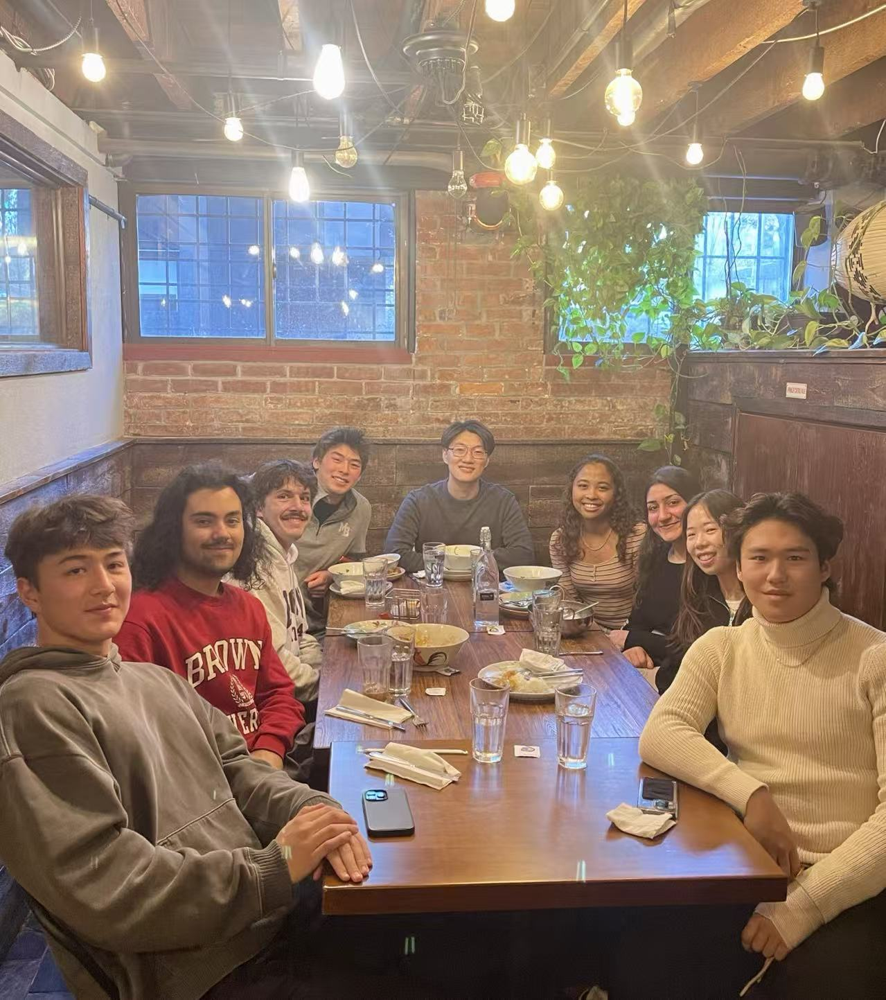
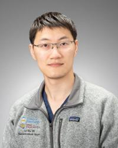

::: {.people-hero}
::: {.people-photo-main}
{fig-alt="Members of the Shu Lab together"}
:::
::: {.people-photo-secondary}
{fig-alt="Shu Lab gathering"}
:::
::: {.people-hero-note}
**Different disciplines, shared purpose.**  
We learn from one another and build work that is stronger because it is collaborative.
:::
:::

## Principal investigator

::: {.pi-card}
::: {.pi-portrait}
{fig-alt="Liqi Shu, MD"}
:::
::: {.pi-copy}
::: {.eyebrow}
Lab director
:::
## Liqi Shu, MD

Vascular Neurologist · [UPMC Stroke Institute](https://providers.upmc.com/provider/liqi-shu/4838362)  
Core Faculty · [Pitt Cerebrovascular Medicine](https://www.neurology.pitt.edu/clinical-divisions/cerebrovascular-medicine)  
Adjunct Instructor in Neurology · [Brown University](https://vivo.brown.edu/display/lshu)

Dr. Shu combines vascular neurology, neurointerventional training, and computational methods to improve stroke-risk prediction, clinical data extraction, and recovery measurement. His work draws on EHR data, international registries, imaging, EEG, motion capture, and wearable sensors.

[Email Dr. Shu](mailto:shul@pitt.edu) · [Google Scholar](https://scholar.google.com/citations?user=uFmbVxEAAAAJ&hl=en) · [ORCID](https://orcid.org/0000-0002-9784-8475)
:::
:::

::: {.profile-facts}
::: {.profile-fact}
::: {.card-number}
Training
:::
**Neurology residency and vascular neurology fellowship**  
Rhode Island Hospital / Brown University
:::
::: {.profile-fact}
::: {.card-number}
Research fellowship
:::
**2024–25 NIH StrokeNet SPIRIT Fellow**  
Completed computational projects in stroke risk and rehabilitation
:::
::: {.profile-fact}
::: {.card-number}
Education
:::
**MD, George Washington University · 2019**  
BS, Computer Science & Biology, Emory University · 2015
:::
:::

## Key collaborators

::: {.people-grid .collaborator-grid}
::: {.person-card}
::: {.person-initials}
RH
:::
### Rebecca Hubbard, PhD
**Biostatistics & real-world evidence**  
Brown University

Statistical methods for EHR and claims data under measurement error, missingness, and complex observation processes.
:::

::: {.person-card}
::: {.person-initials}
JL
:::
### Jonghwan Lee, PhD
**Neural engineering & imaging**  
Brown University

Biomedical optics, photonics, neural engineering, and AI for next-generation imaging and neurotechnology.
:::

::: {.person-card}
::: {.person-initials}
ZJ
:::
### Zhicheng Jiao, PhD
**Radiology AI & computer vision**  
Brown University

Robust medical-image analysis and clinically deployable computer-vision pipelines.
:::

::: {.person-card}
::: {.person-initials}
TX
:::
### Tiffany Xiao, PhD
**Economics & causal inference**  
UC Santa Barbara

Study design and causal inference for real-world questions in stroke and outcomes research.
:::
:::

## Students & trainees

::: {.people-grid .trainee-grid}
::: {.person-card .compact-person}
### Elizabeth Lee
Brown PLME  
[First author: national dissection study](https://pubmed.ncbi.nlm.nih.gov/39647554/){.person-work}
:::
::: {.person-card .compact-person}
### Lukas Strelecky
Brown University · Undergraduate  
[Coauthor: cervical-dissection incidence study](https://pubmed.ncbi.nlm.nih.gov/40173376/){.person-work}
:::
::: {.person-card .compact-person}
### Junyue Ma
Brown University → FlexMed, Mount Sinai
:::
::: {.person-card .compact-person}
### Henry Zheng
Brown University · Undergraduate  
[Coauthor: validated peri-procedural risk model](https://pubmed.ncbi.nlm.nih.gov/42261949/){.person-work}
:::
::: {.person-card .compact-person}
### Xilin Wang
Northeastern University · Computer Science PhD
:::
::: {.person-card .compact-person}
### Levi Neuwirth
Brown University · Undergraduate
:::
::: {.person-card .compact-person}
### Conner Lee
Bowdoin College
:::
::: {.person-card .compact-person}
### Naomi Jack
Brown University · Undergraduate  
[Coauthor: perioperative AF outcomes study](https://pubmed.ncbi.nlm.nih.gov/38944363/){.person-work}
:::
::: {.person-card .compact-person}
### David Marimekala
Brown University · Undergraduate
:::
::: {.person-card .compact-person}
### Moxin Wu
Affiliated Hospital of Jiujiang University  
[Coauthor: validated peri-procedural risk model](https://pubmed.ncbi.nlm.nih.gov/42261949/){.person-work}
:::
:::

::: {.mentorship-outcomes}
::: {.eyebrow}
Mentorship in practice
:::
## Selected trainee-led and trainee-coauthored work

::: {.outcomes-grid}
::: {.outcome-item}
**Elizabeth Lee**  
First author of a national study comparing carotid and vertebral dissections, with Lukas Strelecky as a coauthor. [View publication →](https://pubmed.ncbi.nlm.nih.gov/39647554/)
:::
::: {.outcome-item}
**Lukas Strelecky**  
Coauthor of national work on cervical-dissection incidence trends and recurrent stroke. [View publication →](https://pubmed.ncbi.nlm.nih.gov/40173376/)
:::
::: {.outcome-item}
**Henry Zheng & Moxin Wu**  
Coauthors of the externally validated model and public calculator for 30-day peri-procedural stroke risk. [View publication →](https://pubmed.ncbi.nlm.nih.gov/42261949/)
:::
::: {.outcome-item}
**Naomi Jack**  
Coauthor of completed work on cardiovascular and bleeding outcomes among surgical patients with atrial fibrillation. [View publication →](https://pubmed.ncbi.nlm.nih.gov/38944363/)
:::
:::
:::

## Alumni

::: {.alumni-list}
**Favour Akpokiere** · Brown University · [STOP-CAD thrombolysis coauthor](https://pubmed.ncbi.nlm.nih.gov/39298709/)  
**Christopher Chang** · Brown University · [stroke-recurrence coauthor](https://pubmed.ncbi.nlm.nih.gov/40143807/)  
**John Huang** · Brown University  
**Eileen Wu** · Brown University  
**Anita Zahiri** · Brown PLME
:::

::: {.join-ribbon .people-join}
::: {.join-copy}
::: {.eyebrow}
Join the team
:::
## Interested in clinically useful stroke research?
We welcome thoughtful trainees and collaborators across medicine, data science, and engineering.
:::
[View opportunities](join.qmd){.btn .btn-primary}
:::
